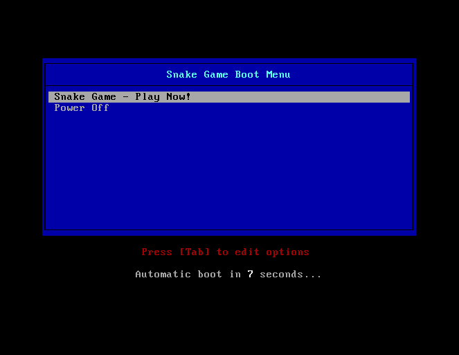

# Snake Bare Metal

This project is a **Snake game** that runs directly on **bare metal** (no operating system).  
The game is written entirely in **x86 Assembly (NASM)** and is booted using **GRUB2** as the bootloader, which provides a simple menu for selecting game options.

---


---


## Project Structure

```
├── snake.asm          # Snake source code (512-byte bootable binary)
├── Makefile           # Build script
└── README.md          # This file
```

---

## Requirements

Required tools:

### Ubuntu / Debian
```bash
sudo apt install nasm qemu-system-x86 xorriso grub-pc-bin
```

### Arch Linux
```bash
sudo pacman -S nasm qemu xorriso grub
```

### macOS (Homebrew)
```bash
brew install nasm qemu xorriso grub
```

---

## Build

### Build Snake binary (512 bytes)
```bash
nasm -f bin snake.asm -o snake_boot.bin
```

### Build raw image (no menu, direct boot)
```bash
make img
```

### Build ISO with GRUB2 menu
```bash
make iso
```

Or simply:
```bash
make
```

---

## Run

### Boot from ISO (with GRUB2 menu)
```bash
make run
```

### Boot from raw image (direct boot, no menu)
```bash
make run-raw
```

---

## GRUB2 Menu

When booting from the ISO, GRUB2 will display a boot menu with the following options:

1. **Snake Game - Play Now!** (Default)
2. **Snake Game (Alternative Boot)** (Using multiboot)
3. **Reboot**
4. **Shutdown**

The menu has a **10-second timeout** before automatically booting the default option.

---

## Controls

* **W** — Move Up
* **A** — Move Left
* **S** — Move Down
* **D** — Move Right
* **R** — Restart after game over

---

## Notes

* `snake.asm` is compiled to **exactly 512 bytes**
* GRUB2 is used **only as a bootloader**, not as an operating system
* The ISO contains:
  * GRUB2 bootloader
  * `snake.bin` (512-byte game)
  * `grub.cfg` (boot menu configuration)
* Two boot methods are available:
  * `linux16` — Standard 16-bit boot
  * `multiboot` — Alternative boot protocol

---

## Testing on Real Hardware

Write the ISO to a USB drive:

### Linux
```bash
sudo dd if=snake.iso of=/dev/sdX bs=4M status=progress && sync
```

### macOS
```bash
sudo dd if=snake.iso of=/dev/diskX bs=4m && sync
```

⚠️ **Warning:** Make sure the target device is correct (e.g., `/dev/sdb`, `/dev/disk2`). All data on the USB drive will be erased!

To find the correct device:
- Linux: `lsblk` or `sudo fdisk -l`
- macOS: `diskutil list`

---

## Clean Build

Remove all generated files:

```bash
make clean
```

---

## Technical Details

### Boot Process
1. BIOS loads GRUB2 from the ISO
2. GRUB2 displays the boot menu
3. User selects "Snake Game - Play Now!"
4. GRUB2 loads `snake.bin` into memory at address `0x7C00`
5. Control is transferred to the game code
6. The game runs in 16-bit real mode with direct VGA text mode access

### Memory Layout
- `0x7C00` — Snake game code (512 bytes)
- `0xB8000` — VGA text mode buffer (80×25 characters)

### VGA Text Mode
- Resolution: 80 columns × 25 rows
- Colors: 16 foreground colors, 8 background colors
- Each character occupies 2 bytes: `[character][attribute]`

---

## Troubleshooting

### "grub-mkrescue not found"
Install GRUB tools:
```bash
# Ubuntu/Debian
sudo apt install grub-pc-bin

# Arch Linux
sudo pacman -S grub

# macOS
brew install grub
```

### "ISO created but won't boot"
Try the alternative boot method from the GRUB menu, or use the raw image:
```bash
make run-raw
```

### "Game doesn't respond to keyboard"
Make sure the QEMU window has focus. Click on the window before pressing keys.

---

## License

This project is provided for learning and experimentation.
You are welcome to modify, enhance, and redistribute it, as long as the original copyright and attribution are preserved.

---

## Credits

**Author:** danko1122  
**Language:** x86 Assembly (NASM)  
**Bootloader:** GRUB2  
**Emulator:** QEMU

---


**Enjoy the game! 🐍**
